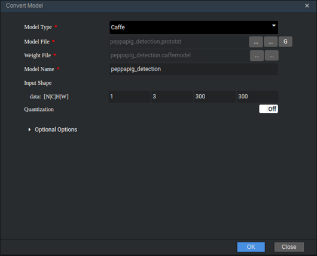
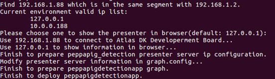
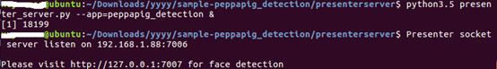

EN|[CN](README_cn.md)

# Peppa Pig Detection<a name="EN-US_TOPIC_0192886472"></a>

Developers can deploy this application on the Atlas 200 DK or the AI acceleration cloud server to decode local MP4 files or RTSP video streams, detect Peppa Pig in video frames, predict its attributes, generate structured information, and send the structured information to the Presenter Server for storage and display.

## Prerequisites<a name="en-us_topic_0191342077_section137245294533"></a>

Before deploying this sample application, ensure that:

-   Mind Studio  has been installed.

-   The Atlas 200 DK developer board has been connected to  Mind Studio, the SD card has been created, and the compilation environment has been configured.

## Software Preparation<a name="en-us_topic_0191342077_section8534138124114"></a>

Before running the sample, obtain the source code package and configure the environment as follows:

1.  <a name="en-us_topic_0191342077_li953280133816"></a>Obtain the source code package.

    Download all the code in the  **sample-peppapigdetection**  repository at  [https://github.com/Ascend/sample-peppapigdetection](https://github.com/Ascend/sample-peppapigdetection)  to any directory on Ubuntu Server where  Mind Studio  is located as the  Mind Studio  installation user, for example,  _/home/ascend/sample-peppapigdetection_.

2.  <a name="en-us_topic_0191342077_li5507119145914"></a>Obtain the original network model required by the application.

    Refer to  [Table 1](#en-us_topic_0191342077_table1193115345597)  to obtain the original network model used in this application and the corresponding weight file. Save them to any directory of the Ubuntu server with  Mind Studio  installed, for example,  **$HOME/ascend/models/peppapigdetection**.

    **Table  1**  Model used in the Peppa Pig detection application

    <a name="en-us_topic_0191342077_table1193115345597"></a>
    <table><thead align="left"><tr id="en-us_topic_0191342077_row1187103505916"><th class="cellrowborder" valign="top" width="15.06%" id="mcps1.2.4.1.1"><p id="en-us_topic_0191342077_p887235105910"><a name="en-us_topic_0191342077_p887235105910"></a><a name="en-us_topic_0191342077_p887235105910"></a>Model Name</p>
    </th>
    <th class="cellrowborder" valign="top" width="10.58%" id="mcps1.2.4.1.2"><p id="en-us_topic_0191342077_p16877355598"><a name="en-us_topic_0191342077_p16877355598"></a><a name="en-us_topic_0191342077_p16877355598"></a>Description</p>
    </th>
    <th class="cellrowborder" valign="top" width="74.36%" id="mcps1.2.4.1.3"><p id="en-us_topic_0191342077_p18713511598"><a name="en-us_topic_0191342077_p18713511598"></a><a name="en-us_topic_0191342077_p18713511598"></a>Download Path</p>
    </th>
    </tr>
    </thead>
    <tbody><tr id="en-us_topic_0191342077_row3881635175910"><td class="cellrowborder" valign="top" width="15.06%" headers="mcps1.2.4.1.1 "><p id="en-us_topic_0191342077_p48863512592"><a name="en-us_topic_0191342077_p48863512592"></a><a name="en-us_topic_0191342077_p48863512592"></a>peppapig_detection</p>
    </td>
    <td class="cellrowborder" valign="top" width="10.58%" headers="mcps1.2.4.1.2 "><p id="en-us_topic_0191342077_p688163513595"><a name="en-us_topic_0191342077_p688163513595"></a><a name="en-us_topic_0191342077_p688163513595"></a>Network model for Piglet Page detection</p>
    <p id="en-us_topic_0191342077_p1488735175914"><a name="en-us_topic_0191342077_p1488735175914"></a><a name="en-us_topic_0191342077_p1488735175914"></a>It is converted from Caffe-based ResNet10-SSD300 model.</p>
    </td>
    <td class="cellrowborder" valign="top" width="74.36%" headers="mcps1.2.4.1.3 "><p id="en-us_topic_0191342077_p1588203519592"><a name="en-us_topic_0191342077_p1588203519592"></a><a name="en-us_topic_0191342077_p1588203519592"></a>Download the source network model file and its weight file by referring to<strong id="en-us_topic_0191342077_b15892227595"><a name="en-us_topic_0191342077_b15892227595"></a><a name="en-us_topic_0191342077_b15892227595"></a> README.md</strong> in <a href="https://github.com/Ascend/models/tree/master/computer_vision/object_detect/peppapig_detection" target="_blank" rel="noopener noreferrer">https://github.com/Ascend/models/tree/master/computer_vision/object_detect/peppapig_detection</a>.</p>
    </td>
    </tr>
    </tbody>
    </table>

3.  Convert the original network model to an offline model supported by the Ascend AI processor.
    1.  Choose  **Tool \> Convert Model**  from the main menu of  Mind Studio. The **Convert Model**  page is displayed.
    2.  On the  **Convert Model**  page, set  **Model File** and  **Weight File**  to the model file and weight file downloaded in  [2](#en-us_topic_0191342077_li5507119145914), respectively.
        -   Set  **Model Name**  to the name of the model in  [Table 1](#en-us_topic_0191342077_table1193115345597).
        -   Retain default values for other parameters.

            **Figure  1**  peppapig\_detection model conversion configuration<a name="en-us_topic_0191342077_fig1160211301238"></a>  
            


    3.  Click  **OK**  to start model conversion.

        During the conversion of the peppapig\_detection model, the following error will be reported.

        **Figure  2**  Model conversion error<a name="en-us_topic_0191342077_fig138681281084"></a>  
        

        Select  **SSDDetectionOutput**  from the  **Suggestion**  drop-down list box at the  **DetectionOutput**  layer and click  **Retry**.

        After successful conversion, a .om offline model is generated in the  **$HOME/tools/che/model-zoo/my-model/xxx**  directory.

4.  Upload the converted .om model file to the  **sample-peppapigdetection/script**  directory in the source code path in  [1](#en-us_topic_0191342077_li953280133816).
5.  Log in to Ubuntu Server where  Mind Studio  is located as the  Mind Studio  installation user and set the environment variable  **DDK\_HOME**.

    **vim \~/.bashrc**

    Run the following commands to add the environment variables  **DDK\_HOME**  and  **LD\_LIBRARY\_PATH**  to the last line:

    **export DDK\_HOME=/home/XXX/tools/che/ddk/ddk**

    **export LD\_LIBRARY\_PATH=$DDK\_HOME/uihost/lib**

    > **NOTE:**   
    >-   **XXX**  indicates the  Mind Studio  installation user, and  **/home/XXX/tools**  indicates the default installation path of the DDK.  
    >-   If the environment variables have been added, skip this step.  

    Enter  **:wq!**  to save settings and exit.

    Run the following command for the environment variable to take effect:

    **source \~/.bashrc**


## Deployment<a name="en-us_topic_0191342077_section1759513564117"></a>

1.  Access the root directory where the Peppa Pig detection application code is located as the  Mind Studio  installation user, for example,  _/home/ascend/sample-peppapigdetection_.
2.  <a name="en-us_topic_0191342077_li08019112542"></a>Run the deployment script to prepare the project environment, including compiling and deploying the public library and configuring Presenter Server. Presenter Server is used to receive the data sent by the application and display the result through the browser. 

    **bash deploy.sh** _host\_ip_ _model\_mode_

    -   _host\_ip_: For the Atlas 200 DK developer board, this parameter indicates the IP address of the developer board. For the AI acceleration cloud server, this parameter indicates the IP address of the host.

    -   _model\_mode_  indicates the deployment mode of the model file. The value can be  **local**  or  **internet**. The default setting is  **internet**.
        -   **local**: If the Ubuntu system where  Mind Studio  is located is not connected to the network, use the local mode. In this case, you need to first download the dependent common code library to the  **/sample-peppapigpeiqi/script**  directory by referring to  [Downloading Dependent Software Libraries](#en-us_topic_0191342077_section13807155164319).
        -   **internet**: If the Ubuntu system where  Mind Studio  is located is connected to the network, use the  **Internet**  mode. In this case, download the dependent code library online.


    Example command:

    **bash deploy.sh 192.168.1.2 internet**

    When the message  **Please choose one to show the presenter in browser \(default: 127.0.0.1\):**  is displayed, enter the IP address used for accessing the Presenter Server service in the browser. Generally, the IP address to be entered is used for accessing the  Mind Studio  service.

    In  **Current environment valid ip list**, select the IP address used by the browser to access the Presenter Server service, as shown in  [Figure 3](#en-us_topic_0191342077_fig184321447181017).

    **Figure  3**  Project deployment<a name="en-us_topic_0191342077_fig184321447181017"></a>  
    

    

3.  <a name="en-us_topic_0191342077_li499911453439"></a>Start Presenter Server.

    Run the following command to start the Presenter Server program of the Peppa Pig detection application in the background:

    **python3 presenterserver/presenter\_server.py --app peppapig\_detection &**

    > **NOTE:**   
    >**presenter\_server.py**  is located in the  **presenterserver**  directory. You can run the  **python3 presenter\_server.py -h**  or  **python3 presenter\_server.py --help**  command in this directory to view the usage method of  **presenter\_server.py**.  

    [Figure 4](#en-us_topic_0191342077_fig69531305324)  shows that the presenter\_server service is started successfully.

    **Figure  4**  Starting the Presenter Server process<a name="en-us_topic_0191342077_fig69531305324"></a>  
    

    Use the URL shown in the preceding figure to log in to Presenter Server \(only the Chrome browser is supported\). The IP address is that entered in  [2](#en-us_topic_0191342077_li08019112542)  and the default port number is  **7011**. The following figure indicates that Presenter Server is started successfully.

    **Figure  5**  Home page<a name="en-us_topic_0191342077_fig64391558352"></a>  
    

    The following figure shows the IP address used by Presenter Server and  Mind Studio  to communicate with the Atlas 200 DK.

    **Figure  6**  Example IP address<a name="en-us_topic_0191342077_fig1881532172010"></a>  
    

    -   The IP address of the Atlas 200 DK developer board is  **192.168.1.2**  \(connected in USB mode\).
    -   The IP address (such as  **192.168.1.223**) used by Presenter Server to communicate with the Atlas 200 DK is in the same network segment as the IP address of the Atlas 200 DK on the Mind Studio server.
    -   The following describes how to access the IP address (such as  **10.10.0.1**) of Presenter Server using a browser. Because Presenter Server and  Mind Studio  are deployed on the same server, you can access  Mind Studio  through the browser using the same IP address.

4.  Prepare a video source.

    Peppa Pig detection supports parsing of local videos and RTSP video streams.

    -   To parse a local video, upload the video file to the host.

        For example, upload the video file  **peiqi.mp4**  to the  **/home/HwHiAiUser/sample**  directory on the host.

        > **NOTE:**   
        >H.264 and H.265 MP4 files are supported. If an MP4 file needs to be edited, you are advised to use FFmpeg. FFmpeg may fail to parse a video file if it is edited by other tools.  

    -   If only RTSP video streams need to be parsed, skip this step.


## Running<a name="en-us_topic_0191342077_section6245151616426"></a>

1.  Run the Peppa Pig detection application.

    Run the following command in the  **/home/ascend/sample-peppapigdetection**  directory to start the Peppa Pig detection application:

    **bash run\_peppapigdetectionapp.sh** _host\_ip_ _presenter\_view\_appname_ _channel1_ _[channel2]_   &

    -   _host\_ip_: For the Atlas 200 DK developer board, this parameter indicates the IP address of the developer board. For the AI acceleration cloud server, this parameter indicates the IP address of the host.
    -   _presenter\_view\_app\_name_: indicates the user-defined value of  **View Name**  displayed on the  **Presenter Server**  page. The value of this parameter must be unique on the  **Presenter Server**  page, which contains only case-senstive leters, digits, and underscores(_).
    -   _channel1_: indicates the absolute path of the video file on the host. The path must be enclosed in double quotation marks. If only video files exist,  _channel2_  is optional.
    -   _channel2_: indicates the URL of an RTSP video stream. The value must be enclosed in double quotation marks. If only RTSP video streams exist, use the space character \(\) as the placeholder of  **channel1**. 

    The following is an example command for running video files:

    **bash run\_peppapigdetectionapp.sh 192.168.1.2 video "/home/HwHiAiUser/sample/peiqi.mp4" &**

    The following is an example command for running RTSP video streams:

    **bash run\_peppapigdetectionapp.sh 192.168.1.2 video " " "rtsp://192.168.2.37:554/cam/realmonitor?channel=1&subtype=0" &**

    > **NOTE:**   
    >Currently, RTSP video streams support only the  **rtsp://ip:port/path**  format. To use URLs in other formats, you need to delete the** IsValidRtsp**  function from the  **video\_decode.cpp**  file or configure the  **IsValidRtsp**  function to directly return  **true**  to skip regular expression matching.  

2.  Click the URL displayed when you start the Presenter Server service to log in to the Presenter Server website (only the Chrome browser is supported). For details, see  [3](#en-us_topic_0191342077_li499911453439).

    Wait for Presenter Agent to transmit data to the server. Click  **Refresh**. When there is data, the icon in the  **Status**  column for the corresponding channel changes to green, as shown in  [Figure 7](#en-us_topic_0191342077_fig113691556202312).

    **Figure  7**  Presenter Server page<a name="en-us_topic_0191342077_fig113691556202312"></a>  
    

    > **NOTE:**   
    >-   Presenter Server of the Peppa Pig Detection application supports a maximum of 10 channels at the same time \(each  _presenter\_view\_app\_name_  parameter corresponds to a channel\).  
    >-   Due to hardware limitations, each channel supports a maximum frame rate of 20 fps. A lower frame rate is automatically used when the network bandwidth is low.  

3.  Click the link (such as  **video**  in the preceding figure) in the  **View Name**  column to view the result. The confidence of the detected Peppa Pig is marked.

## Follow-up Operations<a name="en-us_topic_0191342077_section1092612277429"></a>

-   **Stopping the Peppa Pig Detection Application**

    To stop the Peppa Pig detection application, perform the following operations:

    Run the following command in the  **sample-peppapigdetection**  directory as the  Mind Studio  installation user:

    **bash stop\_peppapigdetectionapp.sh** _host\_ip_

    _host\_ip_: For the Atlas 200 DK developer board, this parameter indicates the IP address of the developer board. For the AI acceleration cloud server, this parameter indicates the IP address of the host.

    Example command:

    **bash stop\_peppapigdetectionapp.sh** _192.168.1.2_

-   **Stopping the Presenter Server Service**

    The Presenter Server service is always in running state after being started. To stop the Presenter Server service of the Peppa Pig detection application, perform the following operations:

    Run the following command as the  Mind Studio  installation user to check the process of the Presenter Server service corresponding to the Peppa Pig detection application:

    **ps -ef | grep presenter | grep peppapig\_detection**

    ```
    ascend@ascend-HP-ProDesk-600-G4-PCI-MT:~/sample-peppapigdetection$ ps -ef | grep presenter | grep peppapig_detection
    ascend 7701 1615 0 15:10 pts/8 00:00:00 python3 presenterserver/presenter_server.py --app peppapig_detection
    ```

    In the preceding information,  _7701_  indicates the process ID of the Presenter Server service corresponding to the Peppa Pig detection application.

    To stop the service, run the following command:

    **kill -9**  7701


## Downloading Dependent Software Libraries<a name="en-us_topic_0191342077_section13807155164319"></a>

Download the dependent software libraries to the  **sample-peppapigdetection/script**  directory.

**Table  2**  Download of dependent software libraries

<a name="en-us_topic_0191342077_table1831612214113"></a>
<table><thead align="left"><tr id="en-us_topic_0191342077_row1531792121119"><th class="cellrowborder" valign="top" width="33.29332933293329%" id="mcps1.2.4.1.1"><p id="en-us_topic_0191342077_p53178291115"><a name="en-us_topic_0191342077_p53178291115"></a><a name="en-us_topic_0191342077_p53178291115"></a>Module Name</p>
</th>
<th class="cellrowborder" valign="top" width="33.373337333733375%" id="mcps1.2.4.1.2"><p id="en-us_topic_0191342077_p1531718212110"><a name="en-us_topic_0191342077_p1531718212110"></a><a name="en-us_topic_0191342077_p1531718212110"></a>Description</p>
</th>
<th class="cellrowborder" valign="top" width="33.33333333333333%" id="mcps1.2.4.1.3"><p id="en-us_topic_0191342077_p8317172131113"><a name="en-us_topic_0191342077_p8317172131113"></a><a name="en-us_topic_0191342077_p8317172131113"></a>Download Path</p>
</th>
</tr>
</thead>
<tbody><tr id="en-us_topic_0191342077_row231702121112"><td class="cellrowborder" valign="top" width="33.29332933293329%" headers="mcps1.2.4.1.1 "><p id="en-us_topic_0191342077_p1431716210119"><a name="en-us_topic_0191342077_p1431716210119"></a><a name="en-us_topic_0191342077_p1431716210119"></a>EZDVPP</p>
</td>
<td class="cellrowborder" valign="top" width="33.373337333733375%" headers="mcps1.2.4.1.2 "><p id="en-us_topic_0191342077_p19318202171113"><a name="en-us_topic_0191342077_p19318202171113"></a><a name="en-us_topic_0191342077_p19318202171113"></a>Encapsulates the DVPP APIs and provides image and video processing capabilities.</p>
</td>
<td class="cellrowborder" valign="top" width="33.33333333333333%" headers="mcps1.2.4.1.3 "><p id="en-us_topic_0191342077_p17318132171116"><a name="en-us_topic_0191342077_p17318132171116"></a><a name="en-us_topic_0191342077_p17318132171116"></a><a href="https://github.com/Ascend/sdk-ezdvpp" target="_blank" rel="noopener noreferrer">https://github.com/Ascend/sdk-ezdvpp</a></p>
<p id="en-us_topic_0191342077_p231814214119"><a name="en-us_topic_0191342077_p231814214119"></a><a name="en-us_topic_0191342077_p231814214119"></a>After the download, keep the folder name <span class="filepath" id="en-us_topic_0191342077_filepath517642017412"><a name="en-us_topic_0191342077_filepath517642017412"></a><a name="en-us_topic_0191342077_filepath517642017412"></a><b>ezdvpp</b></span>.</p>
</td>
</tr>
<tr id="en-us_topic_0191342077_row173187201119"><td class="cellrowborder" valign="top" width="33.29332933293329%" headers="mcps1.2.4.1.1 "><p id="en-us_topic_0191342077_p183188220117"><a name="en-us_topic_0191342077_p183188220117"></a><a name="en-us_topic_0191342077_p183188220117"></a>Presenter Agent</p>
</td>
<td class="cellrowborder" valign="top" width="33.373337333733375%" headers="mcps1.2.4.1.2 "><p id="en-us_topic_0191342077_p13318142101119"><a name="en-us_topic_0191342077_p13318142101119"></a><a name="en-us_topic_0191342077_p13318142101119"></a>Provides APIs for interacting with Presenter Server.</p>
</td>
<td class="cellrowborder" valign="top" width="33.33333333333333%" headers="mcps1.2.4.1.3 "><p id="en-us_topic_0191342077_p63185271115"><a name="en-us_topic_0191342077_p63185271115"></a><a name="en-us_topic_0191342077_p63185271115"></a><a href="https://github.com/Ascend/sdk-presenter/tree/master" target="_blank" rel="noopener noreferrer">https://github.com/Ascend/sdk-presenter/tree/master</a></p>
<p id="en-us_topic_0191342077_p1531819251119"><a name="en-us_topic_0191342077_p1531819251119"></a><a name="en-us_topic_0191342077_p1531819251119"></a>Obtain the <strong id="en-us_topic_0191342077_b35614018427"><a name="en-us_topic_0191342077_b35614018427"></a><a name="en-us_topic_0191342077_b35614018427"></a>presenteragent</strong> folder in this path. After the download, keep the folder name <span class="filepath" id="en-us_topic_0191342077_filepath76811956134111"><a name="en-us_topic_0191342077_filepath76811956134111"></a><a name="en-us_topic_0191342077_filepath76811956134111"></a><b>presenteragent</b></span>.</p>
</td>
</tr>
<tr id="en-us_topic_0191342077_row1318182171114"><td class="cellrowborder" valign="top" width="33.29332933293329%" headers="mcps1.2.4.1.1 "><p id="en-us_topic_0191342077_p1431815218115"><a name="en-us_topic_0191342077_p1431815218115"></a><a name="en-us_topic_0191342077_p1431815218115"></a>FFmpeg (open-source tool)</p>
</td>
<td class="cellrowborder" valign="top" width="33.373337333733375%" headers="mcps1.2.4.1.2 "><p id="en-us_topic_0191342077_p23198241119"><a name="en-us_topic_0191342077_p23198241119"></a><a name="en-us_topic_0191342077_p23198241119"></a>Parses video files.</p>
</td>
<td class="cellrowborder" valign="top" width="33.33333333333333%" headers="mcps1.2.4.1.3 "><p id="en-us_topic_0191342077_p18319926114"><a name="en-us_topic_0191342077_p18319926114"></a><a name="en-us_topic_0191342077_p18319926114"></a>The URL for downloading the FFmpeg 4.0 code is <a href="https://github.com/FFmpeg/FFmpeg/tree/release/4.0" target="_blank" rel="noopener noreferrer">https://github.com/FFmpeg/FFmpeg/tree/release/4.0</a>.</p>
<p id="en-us_topic_0191342077_p731912201113"><a name="en-us_topic_0191342077_p731912201113"></a><a name="en-us_topic_0191342077_p731912201113"></a>After the download, keep the folder name <strong id="en-us_topic_0191342077_b18618937124312"><a name="en-us_topic_0191342077_b18618937124312"></a><a name="en-us_topic_0191342077_b18618937124312"></a>ffmpeg</strong>.</p>
</td>
</tr>
<tr id="en-us_topic_0191342077_row831916220117"><td class="cellrowborder" valign="top" width="33.29332933293329%" headers="mcps1.2.4.1.1 "><p id="en-us_topic_0191342077_p23196214112"><a name="en-us_topic_0191342077_p23196214112"></a><a name="en-us_topic_0191342077_p23196214112"></a>tornado (5.1.0)</p>
<p id="en-us_topic_0191342077_p43196213119"><a name="en-us_topic_0191342077_p43196213119"></a><a name="en-us_topic_0191342077_p43196213119"></a>protobuf (3.5.1)</p>
<p id="en-us_topic_0191342077_p193191626112"><a name="en-us_topic_0191342077_p193191626112"></a><a name="en-us_topic_0191342077_p193191626112"></a>numpy (1.14.2)</p>
</td>
<td class="cellrowborder" valign="top" width="33.373337333733375%" headers="mcps1.2.4.1.2 "><p id="en-us_topic_0191342077_p1331916213111"><a name="en-us_topic_0191342077_p1331916213111"></a><a name="en-us_topic_0191342077_p1331916213111"></a>Indicates the Python libraries that Presenter Server depends on.</p>
</td>
<td class="cellrowborder" valign="top" width="33.33333333333333%" headers="mcps1.2.4.1.3 "><p id="en-us_topic_0191342077_p33192291111"><a name="en-us_topic_0191342077_p33192291111"></a><a name="en-us_topic_0191342077_p33192291111"></a>You can search for related packages on the Python official website at <a href="https://pypi.org/" target="_blank" rel="noopener noreferrer">https://pypi.org/</a> for installation.</p>
<p id="en-us_topic_0191342077_p9319122171111"><a name="en-us_topic_0191342077_p9319122171111"></a><a name="en-us_topic_0191342077_p9319122171111"></a>If the <strong id="en-us_topic_0191342077_b617112374418"><a name="en-us_topic_0191342077_b617112374418"></a><a name="en-us_topic_0191342077_b617112374418"></a>pip3 install</strong> command is used to download files online, you can run the following command to specify the version to be downloaded:</p>
<p id="en-us_topic_0191342077_p12319192181113"><a name="en-us_topic_0191342077_p12319192181113"></a><a name="en-us_topic_0191342077_p12319192181113"></a><strong id="en-us_topic_0191342077_b197812214518"><a name="en-us_topic_0191342077_b197812214518"></a><a name="en-us_topic_0191342077_b197812214518"></a>pip3 install tornado==5.1.0  -i <em id="en-us_topic_0191342077_i17612164520"><a name="en-us_topic_0191342077_i17612164520"></a><a name="en-us_topic_0191342077_i17612164520"></a>Installation source of the specified library</em> --trusted-host <em id="en-us_topic_0191342077_i11778220451"><a name="en-us_topic_0191342077_i11778220451"></a><a name="en-us_topic_0191342077_i11778220451"></a>Host name of the installation source</em></strong></p>
</td>
</tr>
</tbody>
</table>

