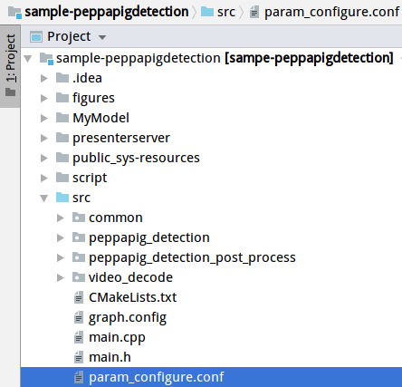
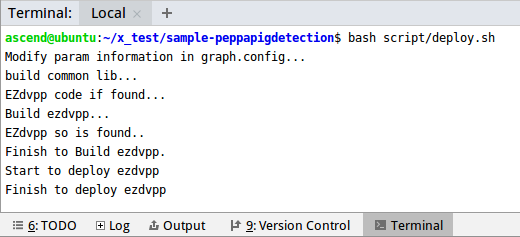
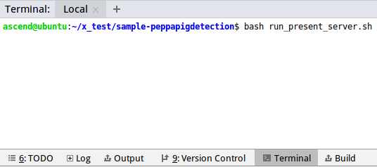
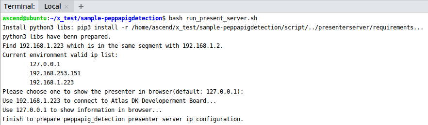
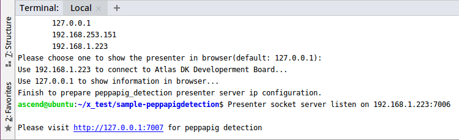
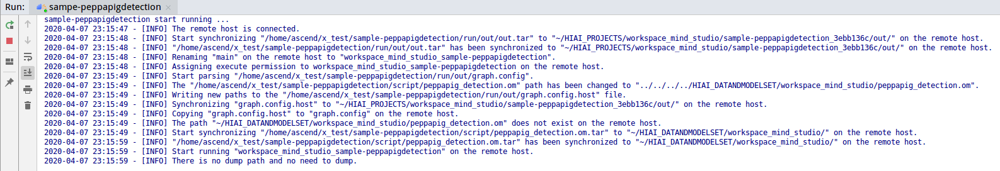
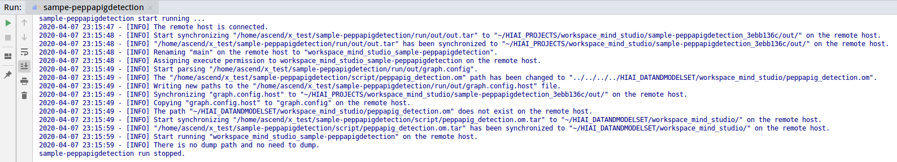

# 小猪佩奇检测<a name="ZH-CN_TOPIC_0219120973"></a>

开发者将本应用部署至Atlas 200 DK或者AI加速云服务器上实现对本地mp4文件或者RTSP视频流进行解码，对视频帧中的小猪佩奇图像进行检测并对其属性进行预测，生成结构化信息发送至Presenter Server端进行保存、展示。

当前分支中的应用适配**1.32.0.0及以上**版本的[DDK&RunTime](https://ascend.huawei.com/resources)。

## 前提条件<a name="zh-cn_topic_0219059426_section137245294533"></a>

部署此Sample前，需要准备好以下环境：

-   已完成Mind Studio的安装。
-   已完成Atlas 200 DK开发者板与Mind Studio的连接，SD卡的制作、编译环境的配置等。

## 部署<a name="zh-cn_topic_0228461893_section412811285117"></a>

可以选择如下快速部署或者常规方法部署，二选一即可：

1.  快速部署，请参考：  [https://github.com/Atlas200dk/faster-deploy](https://github.com/Atlas200dk/faster-deploy)  。

    > **说明：**   
    >-   该快速部署脚本可以快速部署多个案例，请选择**peppapigdetection**案例部署即可。  
    >-   该快速部署脚本自动完成了代码下载、模型转换、环境变量配置等流程，如果需要了解详细的部署过程请选择常规部署方式。转 **：[2. 常规部署](#zh-cn_topic_0228461893_li3208251440)**  

2.  <a name="zh-cn_topic_0228461893_li3208251440"></a>常规部署，请参考：  [https://github.com/Atlas200dk/sample-README/tree/master/sample-peppapigdetection](https://github.com/Atlas200dk/sample-README/tree/master/sample-peppapigdetection)  。

    > **说明：**   
    >-   该部署方式，需要手动完成代码下载、模型转换、环境变量配置等过程。完成后，会对其中的过程更加了解。  


## 编译<a name="zh-cn_topic_0219059426_section1759513564117"></a>

1.  打开对应的工程。

    以Mind Studio安装用户在命令行中进入安装包解压后的“MindStudio-ubuntu/bin”目录，如：$HOME/MindStudio-ubuntu/bin。执行如下命令启动Mind Studio

    **./MindStudio.sh**

    启动成功后，打开**sample-peppapigdetection**工程。

2.  在src/param\_configure.conf文件中配置相关工程信息。

    **图 3**  配置文件路径<a name="zh-cn_topic_0219059426_fig1557065718252"></a>  
    

    

    该配置文件默认配置内容如下：

    ```
    remote_host=192.168.1.2
    presenter_view_app_name=video
    video_path_of_host=/home/HwHiAiUser/peiqi.mp4
    rtsp_video_stream=
    ```

    -   remote\_host：配置为Atlas 200 DK开发者板的IP地址。
    -   presenter\_view\_app\_name: 用户自定义的在PresenterServer界面展示的View Name，此View Name需要在Presenter Server展示界面唯一，只能为大小写字母、数字、“\_”的组合，位数3\~20。
    -   video\_path\_of\_host：配置为HOST侧的视频文件的绝对路径。
    -   rtsp\_video\_stream：配置为RTSP视频流的URL。

    视频文件配置示例如下：

    ```
    remote_host=192.168.1.2
    presenter_view_app_name=video
    video_path_of_host=/home/HwHiAiUser/peiqi.mp4
    rtsp_video_stream=
    ```

    Rtsp视频流配置示例如下：

    ```
    remote_host=192.168.1.2
    presenter_view_app_name=video
    video_path_of_host=
    rtsp_video_stream=rtsp://192.168.2.37:554/cam/realmonitor?channel=1&subtype=0
    ```

    > **说明：**   
    >-   参数remote\_host和presenter\_view\_app\_name：必须全部填写，否则无法通过build。  
    >-   注意所填参数不用使用“”。  
    >-   参数video\_path\_of\_host和rtsp\_video\_stream必须至少填写一项。  
    >-   当前RTSP视频流只支持rtsp://ip:port/path格式，如果需要使用其它格式的url，需要把video\_decode.cpp中的IsValidRtsp函数去除，或者直接返回true，跳过正则表达式匹配。  
    >-   本样例中提供的RTSP流地址不可以直接使用。如果需要使用RTSP，请在本地使用live555或其它方式制作RTSP视频流，并且可以在VLC中播放。然后将本地制作好的RTSP视频流的URL填入配置文件的相应参数中，即可运行。  
    >-   当前已经按照配置示例配置默认值，请按照配置情况自行修改。  

3.  执行deploy脚本， 进行配置参数调整及第三方库下载编译 打开Mind Studio工具的Terminal，此时默认在代码主目录下，执行如下命令在后台指执行deploy脚本，进行环境部署。如[图 执行deploy脚本](#zh-cn_topic_0219059426_fig202009167369)所示。

    **图 4**  执行deploy脚本<a name="zh-cn_topic_0219059426_fig202009167369"></a>  
    

    > **说明：**   
    >-   首次deploy时，没有部署第三方库时会自动下载并编译，耗时可能比较久，请耐心等待。后续再重新编译时，不会重复下载编译，部署如上图所示。  
    >-   deploy时，需要选择与开发板通信的主机侧ip，一般为虚拟网卡配置的ip。如果此ip和开发板ip属于同网段，则会自动选择并部署。如果非同网段，则需要手动输入与开发板通信的主机侧ip才能完成deploy。  

4.  开始编译，打开Mind Studio工具，在工具栏中点击**Build \> Build \> Build-Configuration**。会在目录下生成build和run文件夹。

    > **须知：**   
    >首次编译工程时，**Build \> Build**为灰色不可点击状态。需要点击**Build \> Edit Build Configuration**，配置编译参数后再进行编译。  

5.  启动Presenter Server。

    打开Mindstudio工具的Terminal，在应用代码存放路径下，执行如下命令在后台启动peppapig detection应用的Presenter Server主程序。如[图 启动PresenterServer](#zh-cn_topic_0219059426_fig102142024389)所示。

    **bash run\_present\_server.sh**

    **图 5**  启动PresenterServer<a name="zh-cn_topic_0219059426_fig102142024389"></a>  
    

    

    -   当提示“Please choose one to show the presenter in browser\(default: 127.0.0.1\):“时，请输入在浏览器中访问Presenter Server服务所使用的IP地址（一般为访问Mind Studio的IP地址）。

        如[图6](#zh-cn_topic_0219059426_fig73590910118)所示，请在“Current environment valid ip list“中选择通过浏览器访问Presenter Server服务使用的IP地址，并输入存储视频解析数据的路径。

        **图 6**  工程部署示意图<a name="zh-cn_topic_0219059426_fig73590910118"></a>  
        

        

    如[图7](#zh-cn_topic_0219059426_fig19953175965417)所示，表示presenter\_server的服务启动成功。

    **图 7**  Presenter Server进程启动<a name="zh-cn_topic_0219059426_fig19953175965417"></a>  
    

    

    使用上图提示的URL登录Presenter Server，IP地址为[图6](#zh-cn_topic_0219059426_fig73590910118)中输入的IP地址，端口号默为7007，如下图所示，表示Presenter Server启动成功。

    **图 8**  主页显示<a name="zh-cn_topic_0219059426_fig129539592546"></a>  
    

    Presenter Server、Mind Studio与Atlas 200 DK之间通信使用的IP地址示例如下图所示：

    **图 9**  IP地址示例<a name="zh-cn_topic_0219059426_fig195318596543"></a>  
    

    -   Atlas 200 DK开发者板使用的IP地址为192.168.1.2（USB方式连接）。
    -   Presenter Server与Atlas 200 DK通信的IP地址为UI Host服务器中与Atlas 200 DK在同一网段的IP地址，例如：192.168.1.223。
    -   通过浏览器访问Presenter Server的IP地址本示例为：10.10.0.1，由于Presenter Server与Mind Studio部署在同一服务器，此IP地址也为通过浏览器访问Mind Studio的IP。

6.  小猪佩奇网络统计应用支持解析本地视频和RTSP视频流。
    -   如果需要解析本地视频，需要将视频文件传到Host侧。

        例如将视频文件peppapig.mp4上传到Host侧的“/home/HwHiAiUser/“目录下。

        > **说明：**   
        >支持H264与H265格式的MP4文件，如果MP4文件需要剪辑，建议使用开源工具ffmpeg，使用其他工具剪辑的视频文件ffmpeg工具可能不支持解析。  

    -   如果仅解析RTSP视频流，本步骤可跳过。


## 运行<a name="zh-cn_topic_0219059426_section6245151616426"></a>

1.  运行peppapig detection程序

    在Mind Studio工具的工具栏中找到Run按钮，点击**Run \> Run 'sample-peppapigdetection'**，如[图10](#zh-cn_topic_0219059426_fig12953163061713)所示，可执行程序已经在开发板执行。

    **图 10**  程序运行示意图<a name="zh-cn_topic_0219059426_fig12953163061713"></a>  
    

    

2.  使用启动Presenter Server服务时提示的URL登录 Presenter Server 网站。

    等待Presenter Agent传输数据给服务端，单击“Refresh”刷新，当有数据时相应的Channel 的Status变成绿色，如[图 Presenter Server界面](#zh-cn_topic_0219059426_fig69382913311)所示

    **图 11**  Presenter Server界面<a name="zh-cn_topic_0219059426_fig69382913311"></a>  
    

    > **说明：**   
    >-   peppapig detection的Presenter Server最多支持10路Channel同时显示，每个  _presenter\_view\_app\_name_  对应一路Channel。  
    >-   由于硬件的限制，每一路支持的最大帧率是20fps，受限于网络带宽的影响，帧率会自动适配为较低的帧率进行展示。  

3.  单击右侧对应的View Name链接，比如上图的“video”，查看结果。

## 后续处理<a name="zh-cn_topic_0219059426_section1092612277429"></a>

-   **停止peppapig detection应用**

    peppapig detection应用执行后会处于持续运行状态，若要停止peppapig detection应用程序，可执行如下操作。

    单击停止按钮停止peppapig detection应用程序。如[图 peppapig detection应用程序运行结束](#zh-cn_topic_0219059426_fig464152917203)所示应用程序已停止运行

    **图 12**  peppapig detection应用程序运行结束<a name="zh-cn_topic_0219059426_fig464152917203"></a>  
    

    

-   **停止Presenter Server服务**

    Presenter Server服务启动后会一直处于运行状态，若想停止peppapig detection应用对应的Presenter Server服务，可执行如下操作。

    以Mind Studio安装用户在Mind Studio所在服务器中的命令行中执行如下命令查看peppapig detection应用对应的Presenter Server服务的进程。

    **ps -ef | grep presenter | grep peppapig\_detection**

    ```
    ascend@ascend-HP-ProDesk-600-G4-PCI-MT:~/sample-peppapigdetection$ ps -ef | grep presenter | grep peppapig_detection 
     ascend    7701  1615  0 14:21 pts/8    00:00:00 python3 presenterserver/presenter_server.py --app peppapig_detection
    ```

    如上所示  _7701_  即为peppapig\_detection应用对应的Presenter Server服务的进程ID。

    若想停止此服务，执行如下命令：

    **kill -9** _7701_


